# Introduction to HTML

## The three core technologies of the World Wide Web.


## HTML

* The fundamental technology used to define the structure of a webpage.

## CSS

* CSS is the language that describes the style of an HTML document. CSS describes how HTML elements should be displayed.

## Javascript

* It is used to make dynamic webpages.

# OBJECTIVE

1.  Define HTML.
2.  What is syntax?
3.  What does a HTML element consist of?
4.  What are examples of HTML tags?
5.  Where do our HTML elements live? (between which tags)
6.  What is nesting?
7.  What are HTML attributes?
8.  How do we add images to our webpage?

# HTML DEFINED

1.  **What is HTML?**
    * HTML **(Hypertext Markup Language)** is not a programming language; it is a markup language used to tell your browser how to structure the web pages you visit.
    * HTML consists of a series of elements, which you use to enclose, wrap, or mark up different parts of the content to make it appear or act a certain way.
    * Browsers **don't display HTML tags**, but use them to display content on the webpage.

# SYNTAX
1.  **What is syntax?** If you look up the word syntax in a dictionary, you learn that it’s a set of rules on how to put words and phrases together in order to form good sentences. In other words, syntax means grammar.
2. **How does this relate to programming?** In a programing context, syntax refers to the spelling and grammar of a programming language. Computers are inflexible machines that understand what you type only if you type it in the exact form that the computer expects. **The expected form is called the syntax.**
3. **You’ll see this word a lot. It’s important to follow the syntax (how the code is written) exactly or your browser will not display your page properly.**

# NOT CASE SENSITIVE
1. HTML is **not** case sensitive.
2. That means, you can use either lowercase or uppercase. `<HTML>` is the same as `<html>`. For consistency, use either one or the other. It's best not to mix and match. For our purposes, I have written our code in lowercase.

# HTML TAGS

**HTML has what is called tags.** They are angled brackets `<.....>`. You’ll find these brackets on your keyboard just above the comma and period. Inside these tags are words or letters that tell the computer what to do. For example `<hr>` tells the browser to display a horizontal line. There are two types of tags: **container** and **empty** tags. The difference is simple, container tags come in pairs and empty tags don't. 

# HTML STRUCTURE
1. All HTML documents are divided into two main parts: **the head** and **the body**. When you begin any new page, it must have a declaration: `<!DOCTYPE html>`. It’s telling or declaring to the browser that the following file is an HTML file.

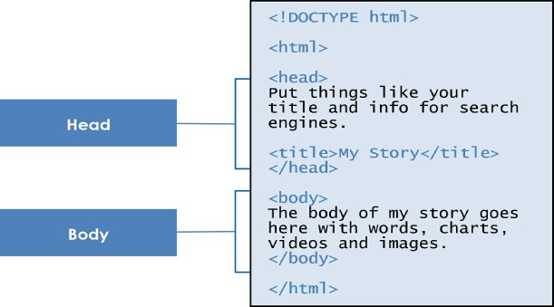

# A HTML DOCUMENT

1. To build any webpage you will need four primary tags: `<html>`, `<head>`, `<title>` and `<body>`. These are all container tags and must appear as pairs with a beginning and an ending.

2. Example
```html
<!DOCTYPE html>
<html>
<head>
<title>Page Title</title>
</head>
<body>

<!–– THIS IS WHERE YOUR HTML ELEMENTS LIVE ––>
<!–– BETWEEN THE BODY TAGS ––>

</body>
</html>
```

## HTML DOCUMENT EXPLAINED

1. `<!DOCTYPE html>` 
    * It’s telling or declaring to the browser that the following file is an HTML file.
2. `<html></html>`
    * Every HTML document begins and ends with the <html> tag. This tells the browser that the following document is an html file. Remember, tags tell the browsers how to display information.
3. `<head></head>` 
    * The <head> tag contains the title of the document along with general information about the file, like the author, copyright, keywords and/or a description of what appears on the page.
4. `<title></title>`
    * Appears within the <head> tags and gives the title of the page. Try to make your titles descriptive, but not more than 20 words in length. The title appears at the very top of the browser page on the title tab.
5. `<body></body>` 
    * Contains all the content that you want to show to web users when they visit your page, whether that's text, images, videos, games, playable audio tracks, or whatever else.

# NESTING

Part of the web page structure is called **nesting**. Notice above how the tag `<title>` is nested inside the `<head>` tag, while `<head>` and `<body>` are nested inside `<html>`.

**Each new set of tags are nested inside other tags**

***
## 🎉 10 MINUTE BREAK
Tips on having an effective break:
1. Bathroom
2. Water
3. Typing drills
***

# YOUR FIRST WEB PAGE

## STEP 1

On MACs we use TextEdit to create HTML documents, Let's open TextEdit:
1. Go to Applications
2. Click on TextEdit

## STEP 2

Type the following code
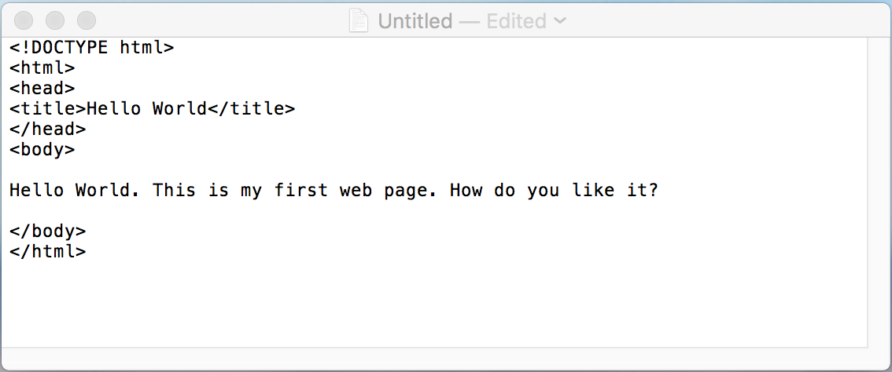

## STEP 3

Save the document as HelloWorld.html. 
1. Go to File
2. Save...
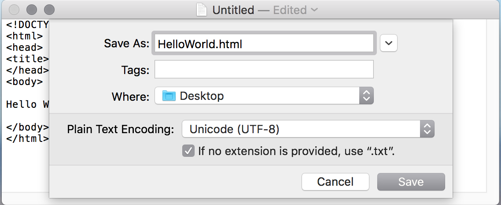
3. Then click Use .html
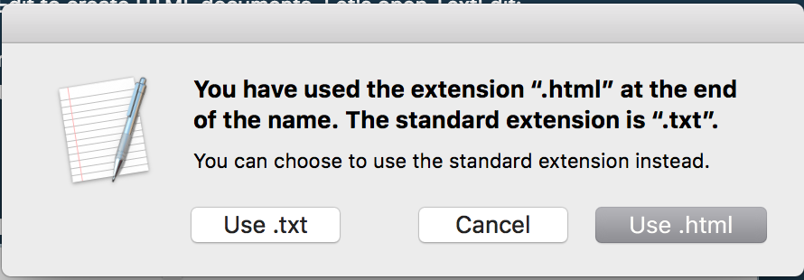

## STEP 4

Open your document in Google Chrome. Find your file on the Desktop, and double click. (if that doesn't work, Open With > Google Chrome)

## CONGRATULATIONS!

You have successfully completed your first web page. It actually doesn’t get any harder than this for your simple, everyday page.

Now let’s learn some more tags.

# BASIC TEXT FORMATTING
After any length of time on the Internet, you’ll notice that a webpage is made up of more than just plain words on a screen. There are headlines, paragraphs, graphics, colors and much more. **It’s a lively place to be. 🎉**

### Paragraphs and Breaks 

`<p>...................</p>`
* Every time you want to begin a new paragraph, you use the paragraph tag. This is a container element, so you need a beginning and an ending tag.

`<br>`
* To add a single line of space, you use the break tag. This is an empty tag and stands alone.

### Horizontal Rule
`<hr>`
* To create a horizontal line on your page

### Headline tag
`<h1>........</h1> to <h6>........</h6>`
* One way to add emphasis and size to text is to use one of six headline tags.
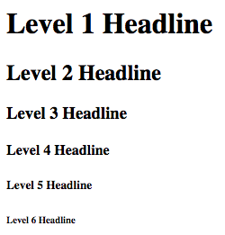

## 🚨 Let's add to our webpage

On your Desktop, Open HelloWorld.html in TextEdit.

1. Change the Title to Your Name
2. Delete everything inside the `<body>....</body>` tags
3. Choose a headline tag and insert it in between the `<body>....</body>` tags and put your name in between.
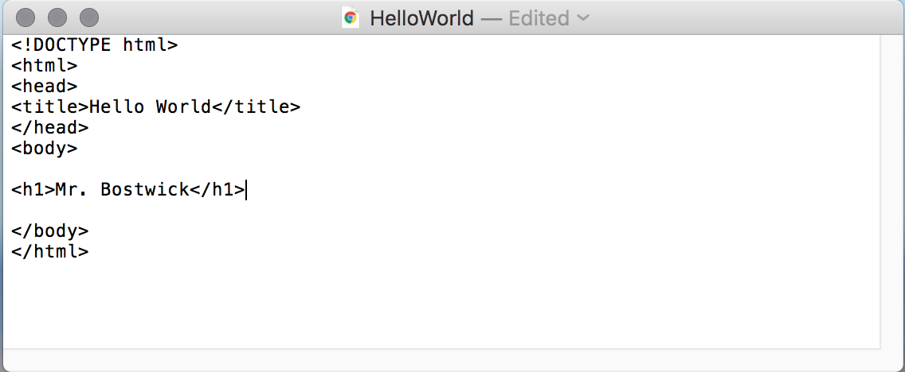
4. Insert a `<hr>` after
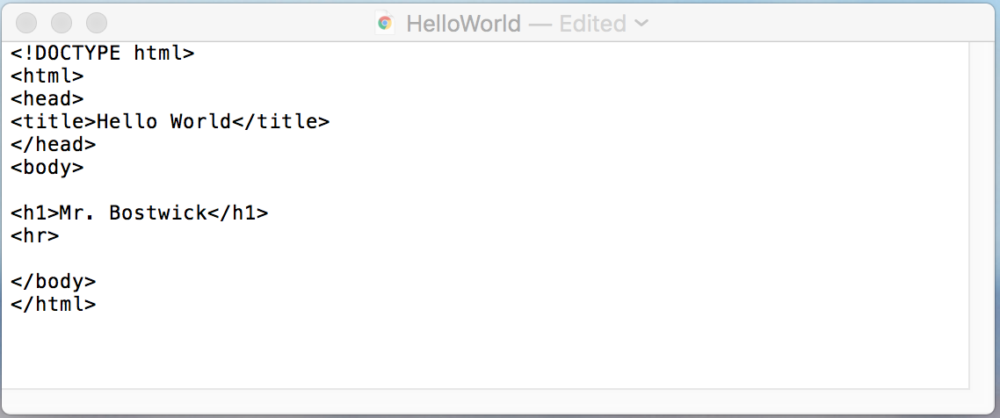
5. Lets create a paragraph about what we've done this summer so far, or what we plan on doing this summer.
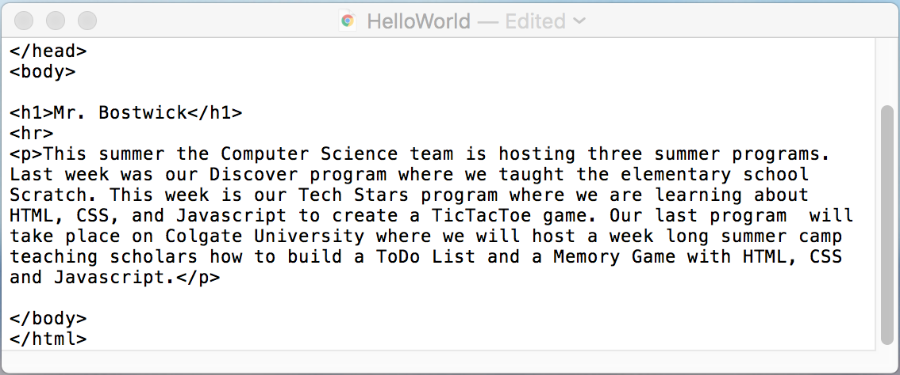

## Making a list and checking it twice

Lists come in a variety of forms with most either numbered or bulleted. The numbered lists are called **ordered lists** and the bulleted lists are **unordered lists**.

Lists are nested. There is a tag that identifies the type of list, like numbered or bulleted. Then within that tag there is another tag that itemizes the list. Maybe some definitions would help.

`<ol>........</ol>`
* The ordered list is a container tag and is used for numbered lists.

`<ul>........</ul>`
* The unordered list is a container tag and is used for bulleted lists.

`<li>........</li>`
* The listed item tag is a container tag and is nested within the ordered or unordered tags.

## 🚨 Let's add to our webpage

6. Lets create a new paragraph with a list nested inside. In our list, we will list our favorite TV shows.
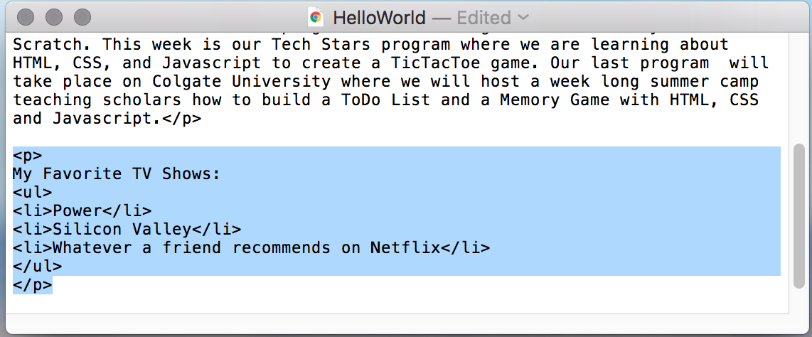

7. Lets create a new paragraph with another list. This time, use the opposite list style. If you used `<ul></ul>` in Step 6, use `<ol></ol>` this time. We will list our favorite sports to play or watch.
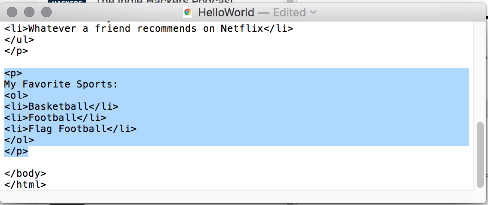

## Creating your first link


Another example of an element is `<a>` — this stands for **"anchor"** and will make the piece of text it wraps around into a **hyperlink**. This can take a number of attributes:

1.  **href:** This attribute specifies the web address that you want the link to go to; where the browser navigates to when the link is clicked. For example, **href="https://www.google.com/"**.
2.  **title:** The title attribute specifies extra information about the link. For example, **title="Google"**. This will appear as a tooltip when hovered over.
3.  **target:** The target attribute specifies the browsing context which will be used to display the link. For example, **target="\_blank"** will display the link in a new tab. If you want to display the link in the current tab just omit this attribute.

## 🚨 Let's add to our webpage
8. Add an anchor tag to our webpage, linking anywhere you want.
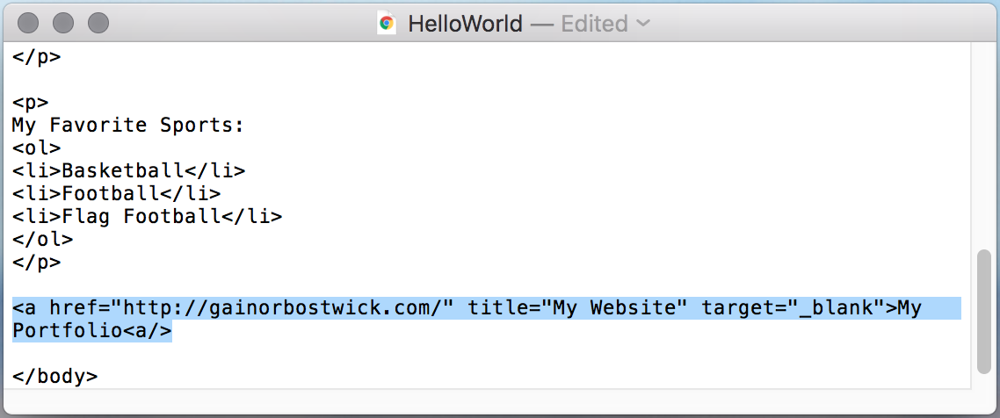

***
## 🎉 10 MINUTE BREAK
Tips on having an effective break:
1. Bathroom
2. Water
3. Typing drills
***

## Adding images to our webpage


Images can improve the design and the appearance of a web page. In HTML, images are defined with the `` tag.

1.  The `` tag is empty, it contains attributes only, **and does not have a closing tag**.
2.  The **src** attribute specifies the URL (web address) of the image:

```html

```

3.  The **alt** attribute provides an alternate text for an image, if the user for some reason cannot view it. The value of the alt attribute should describe the image (a short description):

```html

```

## 🚨 Let's add to our webpage
9. Lets insert `<div>.......</div>` tags and inside them, lets insert image tags. Find an image address on google.
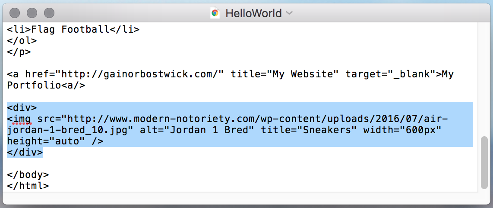

## 🚨 INDEPENDENT ACTIVITY 🚨

1. Go here: https://eraseallkittens.com/
2. Sign In:
    * Email: **gbostwick@bronxexcellence.org**
    * Password: **scholar**

# REVIEW

* HTML tags normally come in pairs like `<p>` and `</p>`
* The first tag (opening tag) in a pair is the start tag, the second tag (closing tag) is the end tag.
* The end tag is written like the start tag, but with a **forward slash inserted before the tag name**.

# CLOSING QUESTIONS 🚨

1.  What are examples of HTML tags?
2.  What are the **3** components that make up a HTML element?
3. What is syntax?

# MAC KEYBOARD SHORTCUTS

1.  CMD + C: Copy
2.  CMD + V: Paste
3.  CMD + X: Cut
4.  CMD + A: Select All
5.  CMD + Z: Undo
