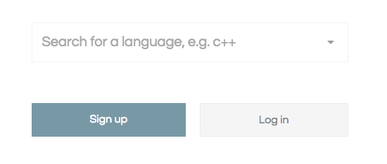

# Introduction to JavaScript


# OBJECTIVE

1.  What is JS?
2.  What is a function?
3.  How do we print something to the console?
4.  What is a variable?
5.  What is an array?
6.  What are parameters?

# JAVASCRIPT DEFINED

1.  JavaScript is the programming language of HTML and the Web.
2.  JavaScript and Java are completely different languages, both in concept and design.

# OUR ONLINE JAVASCRIPT EDITOR

1.  https://repl.it/languages/javascript
2.  OR go to https://repl.it/ \* Choose JavaScript from the dropdown menu
    

# PRINTING TO CONSOLE

1.  As a programmer, printing to console is a very important skill. It is a great tool for debugging our applications and outputting what our programs are doing.

```javascript
console.log("Hello World");
```

# VARIABLES

1.  All JavaScript **variables** must be **identified** with **unique names**.
2.  JavaScript variables are containers for storing data values.
3.  In this example, x, y, and z, are variables:

```javascript
let x = 5;
console.log(x);
let y = 6;
console.log(y);
let z = x + y;
console.log(z);
```

# MUCH LIKE ALGEBRA

1.  In this example, price1, price2, and total, are variables:

```javascript
let price1 = 5;
let price2 = 6;
let total = price1 + price2;
console.log(total);
```

2.  In programming, just like in algebra, we use variables (like price1) to hold values.
3.  In programming, just like in algebra, we use variables in expressions (total = price1 + price2).
4.  From the example above, you can calculate the total to be 11.

# THE ASSIGNMENT OPERATOR

1.  In JavaScript, the equal sign (=) is an "assignment" operator, not an "equal to" operator.
2.  This is different from algebra. The following does not make sense in algebra:

```javascript
x = x + 5;
```

3.  In JavaScript, however, it calculates the value of x + 5 and puts the result into x. The value of x is incremented by 5.

# DATATYPES

1.  In programming, text values are called strings.
2.  JavaScript can handle many types of data, but for now, just think of numbers and strings.
3.  Strings are written inside double or single quotes. Numbers are written without quotes.
    - A JavaScript string is zero or more characters written inside quotes.
4.  If you put a number in quotes, it will be treated as a string.
5.  In case you are curious Javascript has 7 datatypes.

```javascript
let pi = 3.14;
let person = "John Doe";
let answer = "Yes I am!";
```

---

## 🎉 10 MINUTE BREAK

Tips on having an effective break:

1.  Bathroom
2.  Water
3.  Typing drills

---

# CONDITIONAL STATEMENTS

1.  Conditional statements are used to perform different actions based on different conditions.
2.  You can use conditional statements in your code to do this.
3.  In JavaScript we have the following conditional statements:
    - Use `if` to specify a block of code to be executed, if a specified condition is true
    - Use `else` to specify a block of code to be executed, if the same condition is false
    - Use `else if` to specify a new condition to test, if the first condition is false

## THE IF STATEMENT

1.  Use the `if` statement to specify a block of JavaScript code to be executed if a condition is true.

**Syntax:**

```javascript
if (condition) {
  // block of code to be executed if the condition is true
}
```

**Example:**

```javascript
// Can I drive?
let age = 10;

if (age < 16) {
  console.log("No, you can't drive!");
}
```

## THE ELSE STATEMENT

1.  Use the `else` statement to specify a block of code to be executed if the condition is false.

**Syntax:**

```javascript
if (condition) {
  // block of code to be executed if the condition is true
} else {
  // block of code to be executed if the condition is false
}
```

**Example:**

```javascript
// Can I drive?
let age = 10;

if (age < 16) {
  console.log("No, you can't drive!");
} else {
  console.log("Yes, you can drive! Be Safe!");
}
```

## THE ELSE IF STATEMENT

1.  Use the `else if` statement to specify a new condition if the first condition is false.

**Syntax:**

```javascript
if (condition1) {
  // block of code to be executed if condition1 is true
} else if (condition2) {
  // block of code to be executed if the condition1 is false and condition2 is true
} else {
  // block of code to be executed if the condition1 is false and condition2 is false
}
```

**Example:**

```javascript
// Can I drive?
let age = 1;

if (age < 5) {
  console.log(
    "Just because you can drive in Fortnite, doesn't mean you can really drive!"
  );
} else if (age > 5 && age < 16) {
  console.log("No, you can't drive!");
} else {
  console.log("Yes, you can drive! Be Safe!");
}
```

# ARRAYS

1.  JavaScript arrays are used to store multiple values in a single variable.

```javascript
let cars = ["Honda", "Toyota", "BMW"];
```

2.  An array is a special variable, which can hold more than one value at a time.
3.  If you have a list of items (a list of car names, for example), storing the cars in single variables could look like this:

```javascript
let car1 = "Honda";
let car2 = "Toyota";
let car3 = "BMW";
```

4.  An array can hold many values under a single name, and you can access the values by referring to an index number.

Syntax:

```javascript
let array_name = [item1, item2, ...];  
```

Example:

```javascript
let cars = ["Honda", "Toyota", "BMW"];
```

# HOW TO ACCESS THE ELEMENTS OF AN ARRAY

1.  You refer to an array element by referring to the **index number**.
2.  This statement accesses the value of the first element in cars:

```javascript
let car1 = cars[0];
```

3.  [0] is the first element in an array. [1] is the second. Array indexes start with 0.

# LOOPS

1.  Loops can execute a block of code a number of times.
2.  Loops are handy, if you want to run the same code over and over again, each time with a different value.
3.  **THE FOR LOOP** has the following syntax:

```javascript
for (statement 1; statement 2; statement 3) {
    code block to be executed
}
```

4.  Syntax explained:
    - **Statement 1** is executed (one time) before the execution of the code block.
    - **Statement 2** defines the condition for executing the code block.
    - **Statement 3** is executed (every time) after the code block has been executed.
5.  **STATEMENT 1**
    - Normally you will use statement 1 to initialize the variable used in the loop (i = 0).
6.  **STATEMENT 2**
    - Often statement 2 is used to evaluate the condition of the initial variable.
    - If statement 2 returns true, the loop will start over again, if it returns false, the loop will end.
7.  **STATEMENT 3**
    - Often statement 3 increments the value of the initial variable.
    - Statement 3 can do anything like negative increment (i--), positive increment (i = i + 15), or anything else.

This example will print to console each car in the array:

```javascript
let cars = ["Honda", "Toyota", "BMW"];
for (let i = 0; i < cars.length; i++) {
  console.log(cars[i]);
}
```

# FUNCTIONS

1.  A block of code designed to perform a particular task.
2.  Executed when "something" invokes it (calls it).

Examples:

```javascript
function myFunction(p1, p2) {
  return p1 * p2;
  // The function returns the product of p1 and p2
}
myFunction(2, 4);
```

```javascript
function sayMyName() {
  console.log("Hi, Mr. B!");
  // The function will print to console Hi, Mr. B!
}
sayMyName();
```

# FUNCTION SYNTAX

1.  Defined with the **function** keyword, followed by a **name**, followed by parentheses **()**.
2.  Function names can contain letters, digits, underscores, and dollar signs (same rules as variables).
3.  The parentheses may include parameter names separated by commas: **(parameter1, parameter2, ...)**
4.  The code to be executed, by the function, is placed inside curly brackets: **{}**

```javascript
function name(parameter1, parameter2, parameter3) {
    code to be executed
}
```

5.  Function **parameters** are listed inside the parentheses () in the function definition.

# FUNCTION ARGUMENTS

1.  Function **arguments** are the values received by the function when it is invoked (called).
2.  If we had a function defined like this:
    - Notice this function is expecting one parameter called **name**.

```javascript
function sayHi(name) {
  console.log("Hi!" + " " + name);
}
```

2.  We will execute this function like this:
    - Notice, we are passing the function defined above 1 argument with the value of 'Mr. Bostwick':

```javascript
sayHi("Mr. Bostwick");

// or we can use a variable
let myName = "Mr. Bostwick";
sayHi(myName);
```

# INVOKING A FUNCTION

1.  We use the function name and a set of parentheses **()** to invoke a function.
2.  Also known as "Calling a function" or "Running a function".

Example:

```javascript
functionName();
```

# FUNCTION RETURN

1.  When JavaScript reaches a **return statement**, the function will stop executing.
2.  Functions often compute a **return value**. The return value is "returned" back to the "caller":

```javascript
var x = myFunction(4, 3); // Function is called, return value will end up in x

function myFunction(a, b) {
  return a * b; // Function returns the product of a and b
}
```

**x will be 12.**

# WHY FUNCTIONS?

1.  You can reuse code: Define the code once, and use it many times.
2.  You can use the same code many times with different arguments, to produce different results.

```javascript
function myName(first, last) {
  return first + " " + last;
}
```

# HOW TO INCLUDE JAVASCRIPT IN OUR WEBPAGES

1.  We can nest `<script></script>` tags in the bottom of our HTML pages **BEFORE** the closing `</body>` tag. Example:

```html
<!DOCTYPE html>
<html>
  <head>
    <title>Page Title</title>
  </head>
  <body>

  <!–– ALL OF OUR HTML ELEMENTS ––>
  ..........................
  ...................
  ..............
  .........


  <script>
  function myName(first, last){
    return first + ' ' + last;
  }
  </script>
  </body>
</html>
```

**or**

2.  You can include an external file in your HTML file, similarily to the way we included an external CSS file nested in our `<head></head>` tag. We will import our javascript file by placing it **BEFORE** the closing `</body>` tag.

```html
<!DOCTYPE html>
<html>
  <head>
    <title>Page Title</title>
  </head>
  <body>

  <!–– ALL OF OUR HTML ELEMENTS ––>
  ..........................
  ...................
  ..............
  .........

  <script src="myScript.js"></script>
  </body>
</html>
```

---

## 🎉 10 MINUTE BREAK

Tips on having an effective break:

1.  Bathroom
2.  Water
3.  Typing drills

---

# EXERCISES

## VARIABLES

1.  let x = 5 + 2 + 3;
    - What is x?
2.  Declare a variable that stores your first name.
3.  Declare a variable that stores your last name.
4.  Declare a variable that stores your full name.

## FUNCTIONS

1.  Write a function that prints your first name.
2.  Create a function that computes math (addition or multiplication).
3.  Create a function that prints 'Hello World' to the console.

## LOOPS

1.  What is a loop?
2.  Print your name to console 5 times using a loop.

## ARRAYS

1.  Declare an array of Sports.
2.  Declare an array of School Subjects.
3.  Access the 2nd index in your array of Sports and School Subjects then print to console.

## LOGGING TO CONSOLE

1.  Print your name to the console.
2.  Print 'Hello World' to console.
